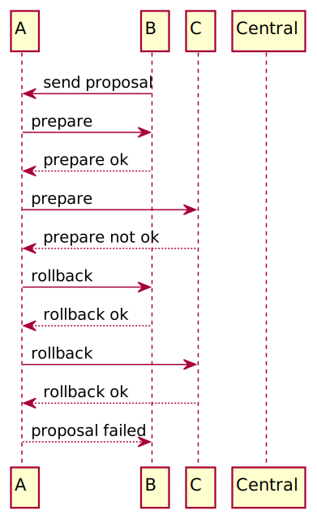

# DBS

DBS as Distributed Broadcast System.

## How to set up

### Install requirements

> pip3 install -r requirements.txt

### Setup Central node
Central used to help nodes found each other. When any common node start, it needs to register to central and retrieve others node's information from central node, therefore you need to start a central node first.

Use config template provided in repo and set IS_CENTRAL_NODE = True to start a central node.

> python3 app.py

### Setup common node
After central node started, then you can start common node.

Change CENTRAL_NODE_ADDRESS in config to central node's address and set IS_CENTRAL_NODE to False, then run:

> python3 app.py

to start a common node.

## API

### Get all data from a node

> curl --location --request GET 'http://xxx.com/data/'

### Post a new data

> curl --location --request PUT 'http://xxx.com/data/' \
--header 'Content-Type: application/json' \
--data-raw '{
  "id": "115",
  "raw": "test",
  "signature": "aaa"
}'

## How it works

### start and election

### post a data and all success

### post a data, then prepare fail but rollback success

### post a data, then prepare fail and rollback fail as well

### post a data and prepare success, then submit fail

